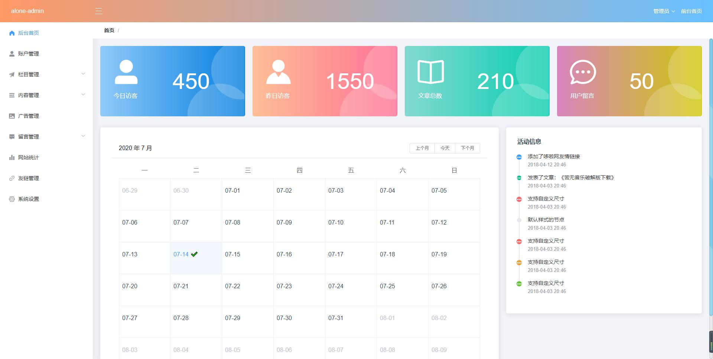

# alone-admin
alone-admin是基于vue+element-ui开发的后台管理系统，至于其他的介绍，看下面的图自行脑补哈。

## 项目运行
```
git clone git@github.com:pmb2020/alone-admin.git //克隆项目到本地
cd alone-admin  //进入项目
npm install  //npm安装依赖
npm run server //运行项目
```

### Compiles and hot-reloads for development
```
npm run serve
```

### Compiles and minifies for production
```
npm run build
```

### Lints and fixes files
```
npm run lint
```

### Customize configuration
See [Configuration Reference](https://cli.vuejs.org/config/).
